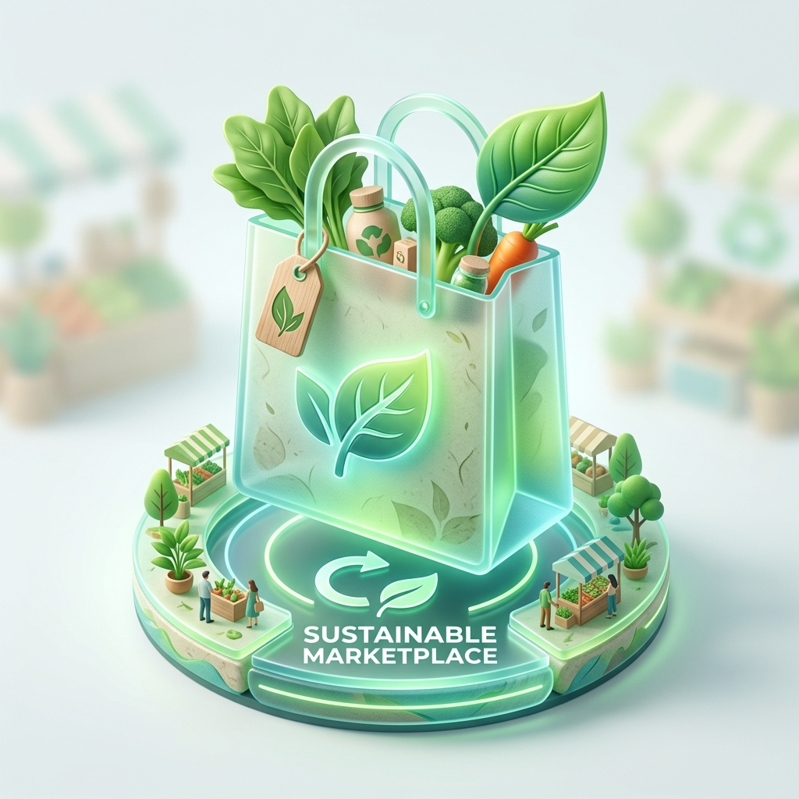
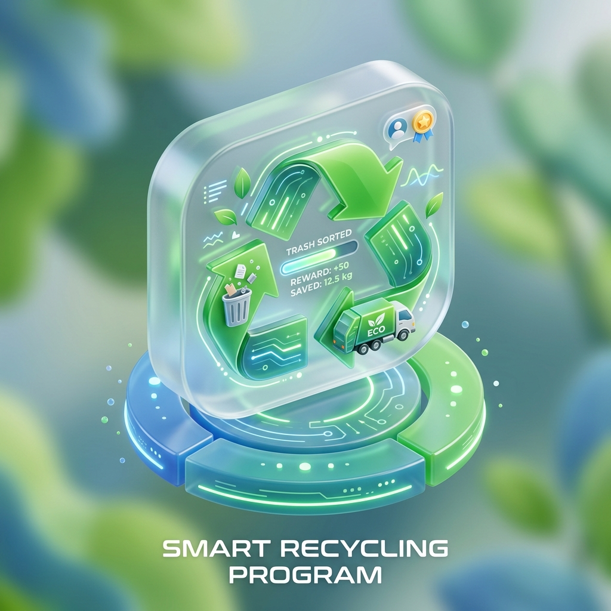

# 🌿 VERDANA — Eco-Friendly E-commerce & Sustainability Platform

<p align="center">
  
</p>

<p align="center">
  
  
  
  
</p>

## 🚀 Overview
**Verdana** is a premium sustainability platform designed to empower users to live a greener, more eco-conscious lifestyle. It seamlessly combines a high-end e-commerce experience with interactive tools for carbon footprint tracking and smart waste management. Built for the modern, environmentally aware consumer, Verdana makes sustainability both accessible and elegant.

---

## 🛠️ Core Modules Showcase

<div align="center">

| | |
| :---: | :---: |
| <br>**Sustainable Marketplace** | <br>**Smart Recycling Program** |
| A curated collection of eco-certified products, featuring seamless Razorpay checkout and detailed order tracking. | Schedule doorstep pickups for plastic, paper, and electronic waste with a dedicated admin logistics dashboard. |
| <br>**Carbon Calculator** | <br>**AI-Powered Assistant** |
| Interactive tool to track and reduce your environmental impact based on lifestyle and consumption habits. | "Verdana Brain" — A context-aware chatbot for sustainability advice and order tracking. |

</div>

---

## ✨ Premium Features
- **🤖 Verdana Brain**: AI-integrated assistant powered by Google Gemini for personalized eco-advice.
- **🔐 Secure Payments**: Fully integrated **Razorpay** gateway for a smooth and safe shopping experience.
- **♻️ Waste Logistics**: End-to-end management of recycling requests, from user scheduling to admin assignment.
- **📊 Impact Analytics**: Real-time tracking of the user's positive environmental contribution.
- **📱 Glassmorphic UI**: A modern, nature-inspired design system with smooth transitions and responsive layouts.
- **🌲 Eco-Certified Inventory**: Rigorous management of products with detailed sustainability specifications.

---

## 📊 Administrative Management
Verdana provides a feature-rich administrative suite for business owners to oversee operations efficiently.

- **Inventory Control**: Real-time management of product listings, categories, and stock levels.
- **Order Insights**: Detailed breakdown of sales, shipping info, and revenue analytics.
- **Recycling Dashboard**: Centralized hub to manage pickup requests and monitor waste diversion metrics.
- **User Management**: Oversight of user profiles, authentication, and security.

---

## 💻 Technical Excellence
Built with a focus on performance, scalability, and modern web standards.

- **Backend**: **Django (Python)** providing a robust and secure foundation.
- **Database**: Efficient **SQLite3** configuration for reliable data persistence.
- **AI Integration**: **Google Generative AI (Gemini)** for intelligent conversational capabilities.
- **Frontend**: Custom **Vanilla CSS** design system utilizing modern Glassmorphism and CSS variables.
- **Payment Gateway**: **Razorpay** for industry-standard financial transactions.
- **Architecture**: Clean, modular code following the MVT pattern for easy maintainability.

---

## ⚙️ Getting Started

### 📋 Prerequisites
- Python 3.9+
- Pip & Virtualenv
- Razorpay API Keys
- Gemini API Key

### 🚀 Installation
1. **Clone the repository**
   ```bash
   git clone https://github.com/your-username/eco-friendly-verdana.git
   cd eco-friendly-verdana
   ```
2. **Setup Environment**
   ```bash
   python -m venv my_venv
   source my_venv/bin/activate  # On Windows: my_venv\Scripts\activate
   pip install -r requirements.txt
   ```
3. **Configure API Keys**
   - Update `settings.py` with your credentials.
4. **Run Migrations & Start Server**
   ```bash
   python manage.py migrate
   python manage.py runserver
   ```

---

## 🤝 Support & Contact
We welcome contributions to help push the mission of sustainability forward!

📧 **kavipriyan292004@gmail.com** | 🌐 **[Verdana Portfolio](https://kaviportfilio.netlify.app/)**

---
<p align="center">
  <b>Verdana: Vote for a Greener Future. 🌍</b><br>
  Developed with ❤️ for a Sustainable Tomorrow
</p>

